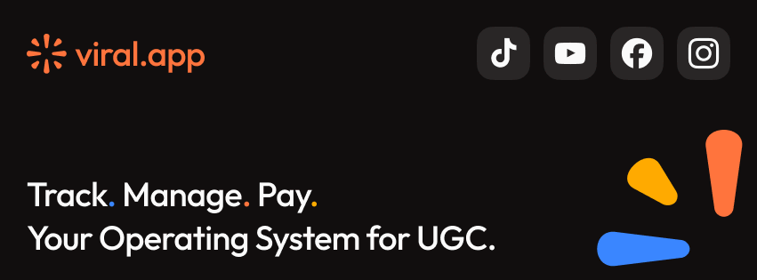

### About me

Hey, I'm a fullstack developer and founder based in Germany.

I have been building software in Health, Crypto, and AI for over a decade after completing my computer science degree.

When I'm not shipping products, I like to cook with my wife, play with our toddler, and hit some balls over the net.

​ ​​
​ ​​

***

[**viral.app**](https://viral.app) - The operating system for UGC marketing.

Track TikTok, Instagram Reels, YouTube Shorts, and UGC creator campaigns in one place. Manage creators, analytics, reporting, and payouts with viral.app.

***

